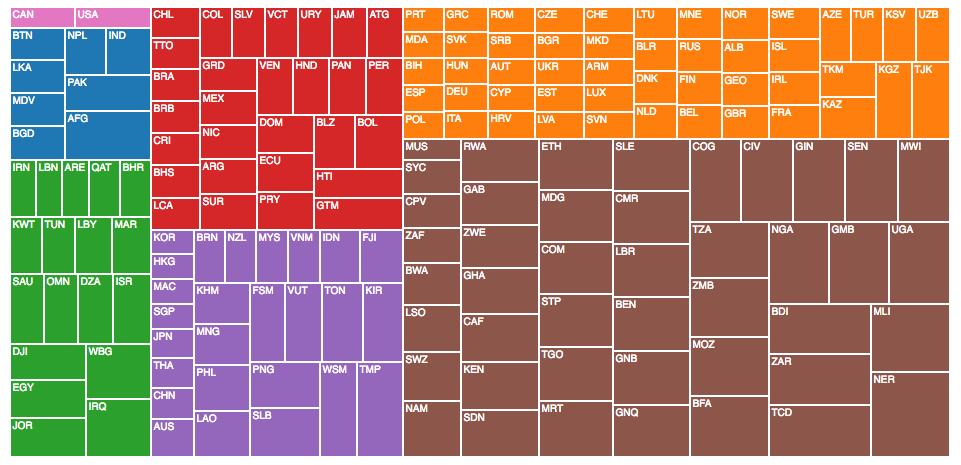

## Exercise 1: Building a Treemap

This exercise is a more robust opportunity to visualize data using D3. Data on the life expectancy and GDP of countries has been prepared after downloading it from the [World Bank Website](http://data.worldbank.org/data-catalog/world-development-indicators). As usual, once you fork and clone this repository, instructions will appear in the `index.html` and `js/main.js` files. Unlike previous exercises, this exercise details high-level requirements rather than writing out step-by-step instructions.

Your final product should look like this

The following resources may be helpful:

- [D3 Layouts](https://github.com/mbostock/d3/wiki/Layouts) _(d3 wiki)_
- [Nest Method](https://github.com/mbostock/d3/wiki/Arrays#nest) _(d3 wiki)_
- [Treemap Layout](https://github.com/mbostock/d3/wiki/Treemap-Layout) _(d3 wiki)_
- [Treemap Example](https://bl.ocks.org/mbostock/4063582) _(bl.ocks)_
