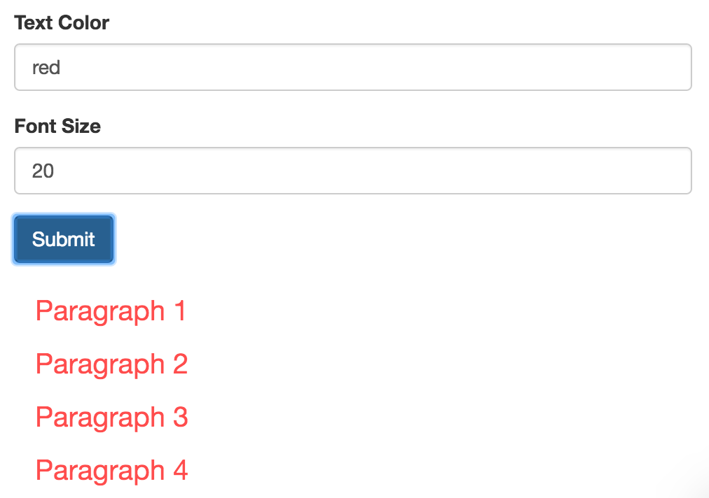

## Exercise 2: Reusability

This exercise brings together lessons from throughout the module. As usual, fork and clone this repository, and follow the steps outlines in the `index.html` file to build the project. When you complete it, you should have an understanding of how to leverage the suggested pattern of reusability to build D3 components.

Your final product should look like this

You may find the following resources helpful:

- [Towards Reusable Charts](https://bost.ocks.org/mike/chart/) _(Bostock)_
- [Data versus Datum](http://stackoverflow.com/questions/13728402/what-is-the-difference-d3-datum-vs-data) _(stackoverflow)_
